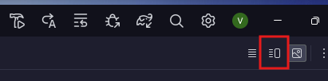
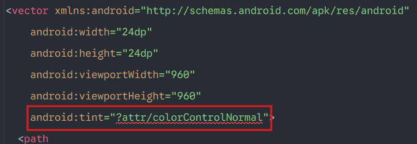

1. Copia todas las dependencias **(libs.versions.toml)**
2. Luego todo lo del **build.gradle.kts (global)**
3. Luego todo lo del **build.gradle.kts (app) - Ten en cuenta el nombre del proyecto**
4. Divide el proyecto tal cual lo ves acá y siempre ve en el siguiente orden: **domain - data - presentation**

# Para importar imágenes
1. **Ve** a [google fonts](https://fonts.google.com/icons)
2. **Selecciona** la imagen q quieras
3. **Ve** a la pestaña "Android"
4. **Descárgala**
5. Luego ve a la pestaña **"Resource Manager"** del Android Studio
6. Dale click en el símbolo **"+"**, luego en **"Import drawables"**
7. E **importa** la imagen que descargaste
8. Cámbiale el nombre, **si quieres**
9. Dale en **"Next"** y **"Next" otra vez**
10. Dale **doble click** a la imagen en el **Resource Manager** y luego dale click en el botón:

  

11. Luego borra lo q te aparece en rojo:

  

12. Y ya xd
